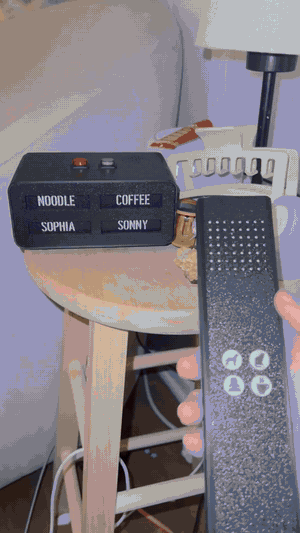
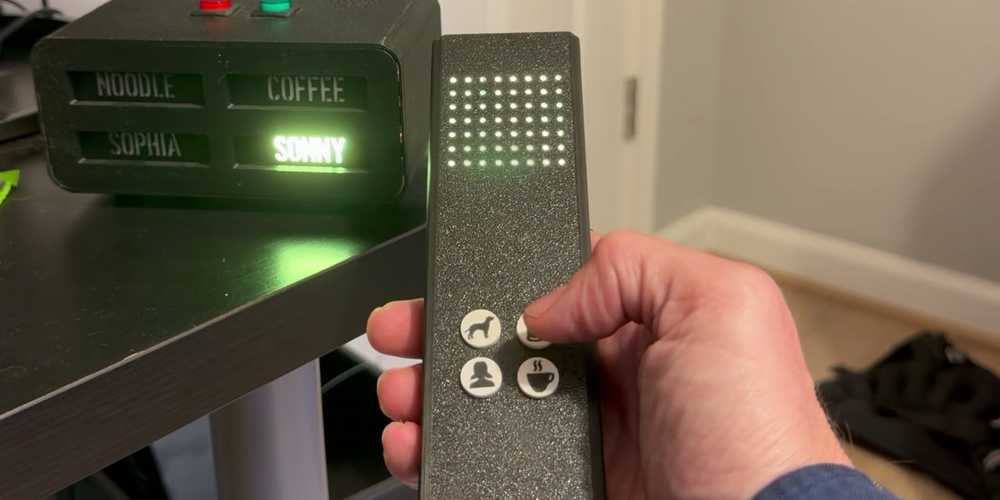
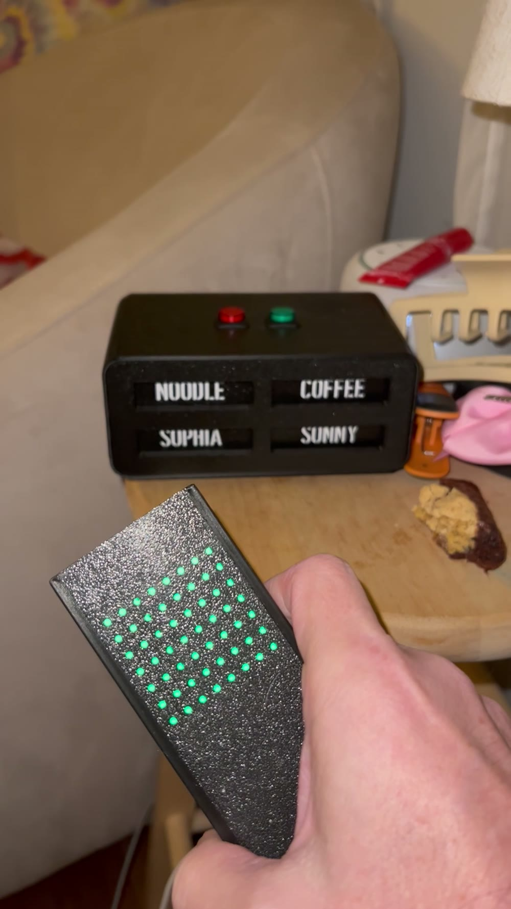
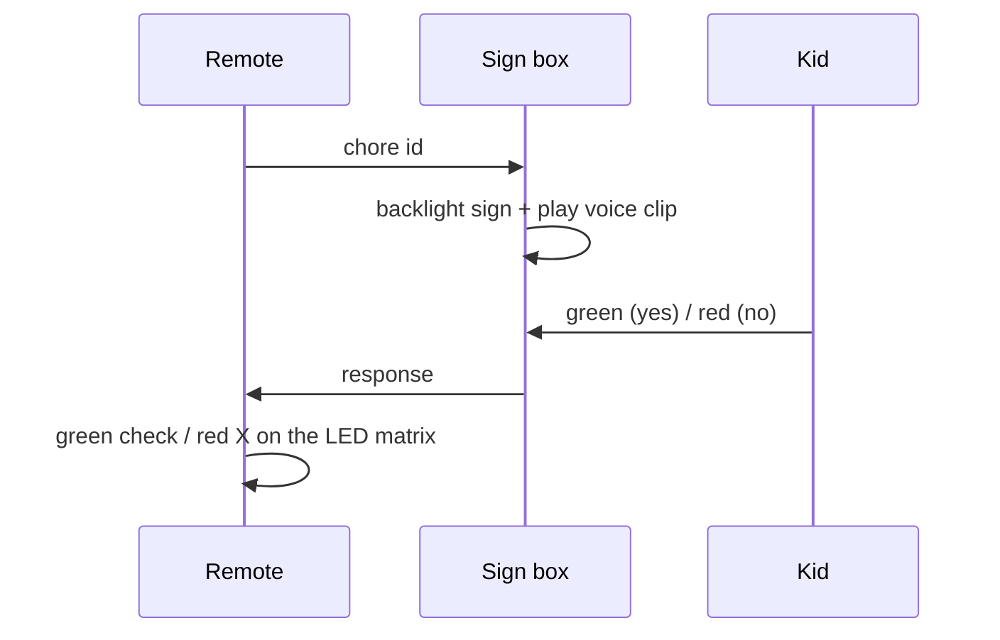
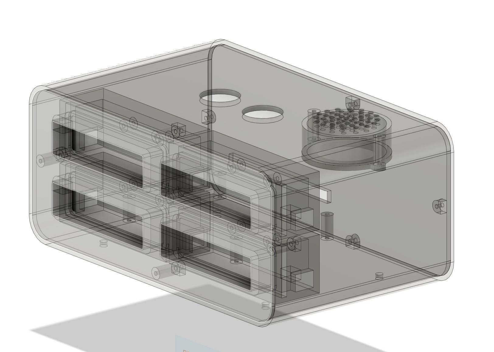
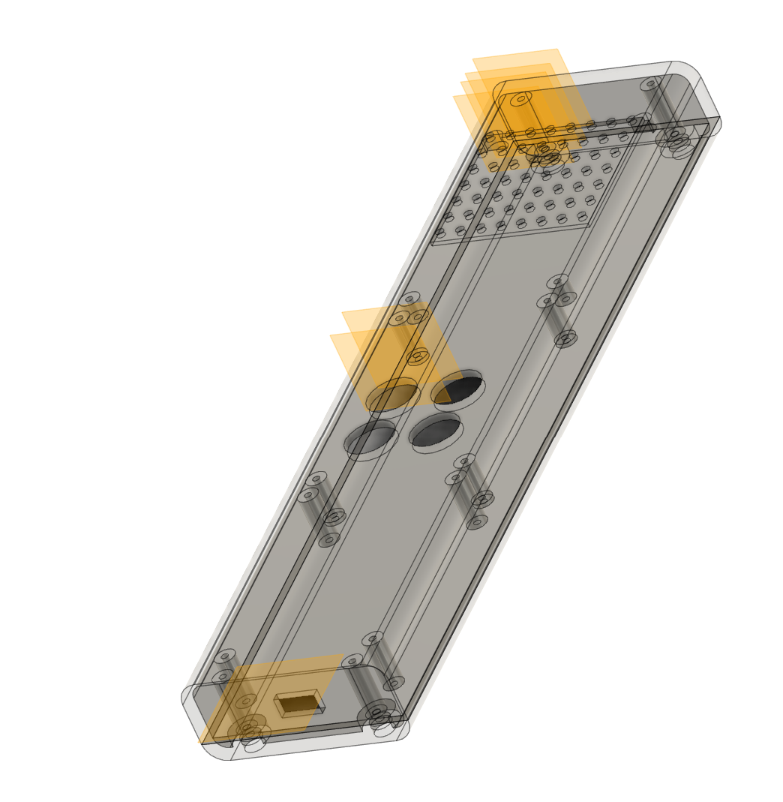

# Chore Box

A wireless "ask and answer" device for a nine-year-old, designed from a blank Fusion 360 sketch through
soldering, 3D printing, and firmware. My daughter came up with the idea; I built it.



<a href="https://github.com/user-attachments/assets/9ae32d3d-ac2b-4bfa-8aff-e03311b34ef0" target="_blank" rel="noopener noreferrer"><b>▶ Watch the full clip with sound</b></a> — the box plays a recording of my voice saying the word.

## The idea

Nagging is a broadcast protocol with no acknowledgment. This replaces it with a request/response handshake
that a kid actually enjoys running.

1. I press one of four icon buttons on the remote — dog, cat, Sophia, coffee.
2. The box lights the matching sign (**NOODLE**, **SONNY**, **SOPHIA**, **COFFEE**) and plays a recording of
   my voice saying the word through its onboard speaker.
3. My daughter answers with the green or red button on top of the box.
4. The remote reports back on its LED matrix — a green check if she agreed, red if she refused.

The coffee button is for my wife.

<p align="center">
  
  
</p>

## How it works



Both halves are battery powered and sleep between interactions, so the whole thing lives on a side table with
no wires and nothing to plug in.

### The sign box



Four backlit label windows in a 2×2 grid on the front, green and red response buttons on top, speaker firing
up through a printed grille. The CAD above is the enclosure with the internal standoffs, button retainers,
and LED pockets that hold everything in place without hardware where I could avoid it.

### The remote



A wand form factor sized for one hand: four icon buttons under the thumb, an LED matrix behind a diffused
window for the answer, and a USB port at the tail for charging. Packing a microcontroller, radio, matrix, and
battery into that cross-section was most of the design work.

## Components

| | |
|---|---|
| Microcontrollers | Adafruit Feather (**TBD — exact boards**) |
| Wireless | **TBD — radio and protocol** |
| Audio | MP3 player module + amplifier driving a small speaker |
| Indicators | LED matrix on the remote, backlight LEDs behind each sign |
| Power | LiPo, **TBD — capacity and measured runtime** |
| Enclosures | 3D printed on a Bambu Lab X1C |

## What I had to learn

None of this was in my wheelhouse when I started. The point of the project was that it wasn't.

**CAD and printing** — Fusion 360 from scratch: parametric sketching, joints, and designing enclosures that
are actually printable. Bambu Studio, supports, orientation, and the fit tolerances you only learn by getting
them wrong. Both enclosures went through **TBD** print revisions before the components dropped in cleanly.

**Electronics** — Choosing the parts at all: which Feather, which MP3/amp module, what the LEDs and speaker
needed, how to power it. Schematic capture in Fritzing, then soldering the whole thing together by hand.

**Firmware** — Arduino, C++. Establishing the wireless link between the two devices and defining a message
format for chore requests and responses. Driving the LED animations. Putting both devices to sleep and waking
them on a button press so the batteries last.

**Industrial design** — Form factor and aesthetics, not just function. Something that reads as a product on a
side table, and a remote that feels right in a hand.

## Problems worth talking about

**The wireless link took several attempts.** *(TBD — which approaches failed and why, and what finally
worked. This is the most interesting story in the project.)*

**Battery life meant sleeping everything.** Both devices spend nearly all their time asleep; the design
problem is waking fast enough that a button press feels instant. *(TBD — measured runtime.)*

**Packaging.** The remote's cross-section was set by what feels good to hold, not by what fits inside, so
component placement had to work backward from an ergonomic shell.

## Repo contents

```
media/      renders, stills, and the demo clip
```

*(TBD — firmware source, Fusion exports / STLs, and the Fritzing schematic to be added.)*

---

### To fill in before publishing — delete this section

- [ ] Exact Feather boards and the radio/protocol that worked
- [ ] Which wireless approaches failed, and how they failed
- [ ] Measured battery life, and what the target was
- [ ] Whether the box acknowledges the remote, and what happens on a dropped message
- [ ] Enclosure revision count
- [ ] How the sign labels are made (printed inlay? painted? cut vinyl?)
- [ ] Rough project duration, and whether it's still in daily use
- [ ] Push the firmware, CAD exports, and schematic into this repo
