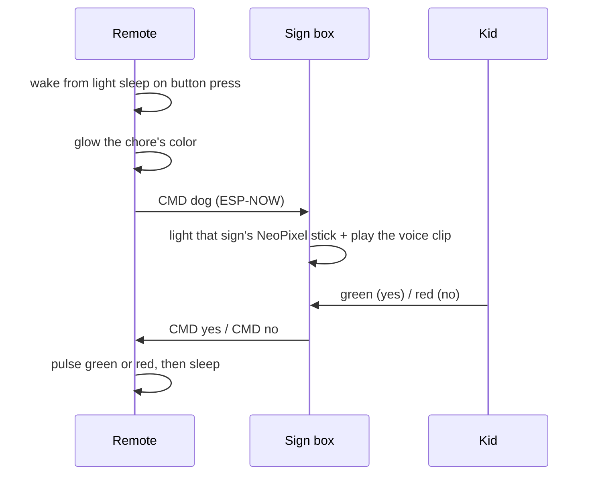
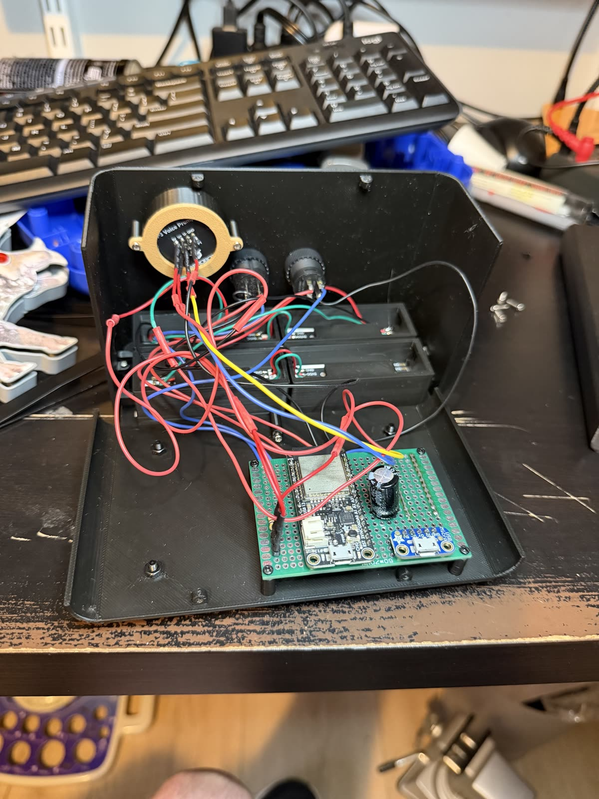
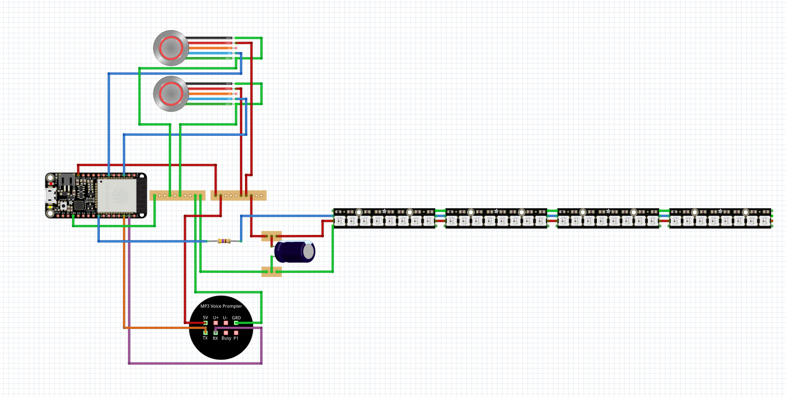
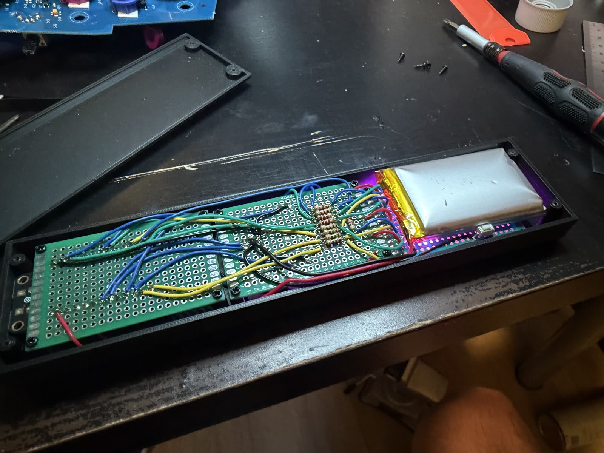
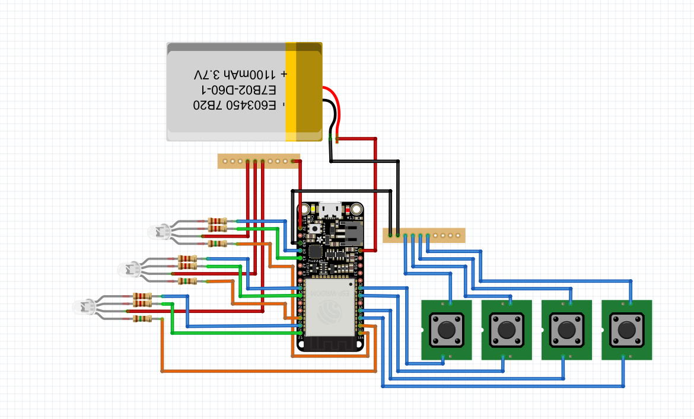

# Chore Box

A wireless "ask and answer" device, designed from a blank Fusion 360 sketch through
soldering, 3D printing, and firmware. My daughter came up with the idea; I built it.


[**▶ Watch the full clip with sound**](https://github.com/user-attachments/assets/8d35b82a-c8e0-47bb-88b0-e17c1cc6b25d) - the box plays a recording of my voice saying the word.

## The idea

We have common things we might ask our daughter to do on any given day. Instead of yelling throughout the
house, we can use this remote control interface. Now my partner can request coffee without speaking a word.

1. I press one of four icon buttons on the remote - dog, cat, Sophia, coffee.
2. The box lights the matching sign - **NOODLE** the dog, **SONNY** the cat, **SOPHIA**, **COFFEE** - and
   plays a recording of my voice saying the word through its onboard speaker.
3. My daughter answers with the green or red button on top of the box.
4. The remote's window pulses green if she agreed, red if she refused.

Each chore owns a color, and both halves use it: press the coffee button and the remote glows purple while
the COFFEE sign glows purple across the room. The pending state is the color of the thing being asked for.

| Chore | Color |
|---|---|
| Coffee | purple |
| Sophia | orange |
| Dog (Noodle) | blue |
| Cat (Sonny) | yellow |

## How it works



The two halves talk over **ESP-NOW** - no router, no pairing, no network. Each board has the other's MAC
address compiled in, and the payload is a plain ASCII string: `CMD dog`, `CMD yes`, `CMD no`. That's the
whole protocol.

If the box never answers, the remote gives up after 90 seconds, sends `CMD disable` to clear the sign, and
goes back to sleep - so a message dropped in either direction can't leave a sign lit forever.

### The sign box

<p align="center">
  
  
</p>

Four backlit label windows in a 2×2 grid on the front, green and red response buttons on top, speaker firing
up through a printed grille. The letters are printed into slide-in panels which sit in front of a light
cavity, with paper behind them doing the diffusing. Behind each window is an [Adafruit NeoPixel
Stick](https://www.adafruit.com/product/1426) - 8 pixels each, 32 in one chain off a single pin.
Voice clips come off a 30 × 11 mm voice-prompt module with the speaker built into it -
16 MB of onboard flash holding one recording per chore, played by index over a second UART. No SD card, no
separate amplifier.

The two response buttons are wired to be illuminated, so the answer she's about to give would be lit under
her hand. As far as I can tell those LEDs either never worked or I burned them out - and I didn't want to
hold the project up waiting on replacements.



The four sticks chain into one run off a single data pin, with the usual NeoPixel precautions - a series
resistor on the data line and a bulk capacitor across the supply. The voice prompter hangs off its own UART.

### The remote

<p align="center">
  
  
</p>

A wand form factor sized for one hand: four icon buttons under the thumb, a diffused window for the answer,
and a USB port at the tail for charging. Packing a microcontroller, radio, indicator, and battery into that
cross-section was most of the design work.

The window isn't a display. It reads like a dot matrix, but the dots are printed into the face - behind them
are three [Adafruit RGB Full Color Backlight
Displays](https://www.adafruit.com/product/6158), 12 × 40 mm strips driven as nine PWM channels so the whole
face washes to a single color. They're common anode, which is why the firmware writes `255 - value`.

That's what makes the yes/no answer readable from across a room: an eight-second breathing pulse of green or
red, not a symbol you have to walk over and read.



Fritzing has no part for the backlight strips, so they're drawn as plain RGB LEDs - the topology is the same,
nine channels each through its own resistor. The four buttons are the wake sources: any one of them pulls the
ESP32 out of light sleep.

The remote is the only half on a battery, so it spends nearly all of its life in light sleep at
80 MHz with the radio torn down entirely. A button press wakes it, the radio comes up, the message goes out,
and everything shuts back down after the answer.

## Components

| | |
|---|---|
| Microcontrollers | Adafruit HUZZAH32 (ESP32 Feather) - one per half, on 50×70 mm protoboard |
| Wireless | ESP-NOW, unencrypted, peer MACs hard-coded, ASCII `CMD <verb>` payloads |
| Audio | [Voice-prompt module with integrated speaker](https://www.amazon.com/dp/B0DQQ3W32D) - 30 × 11 mm, 16 MB onboard flash, `7E … EF` frames at 9600 baud |
| Sign lighting | 4 × Adafruit NeoPixel Stick, 8 pixels each, 32 total on one data pin |
| Remote indicator | 3 × RGB backlight panels, 9 LEDC PWM channels at 5 kHz / 8-bit |
| Diffusion | Paper, behind the sign windows |
| Power | Remote runs on a 1100 mAh 3.7 V LiPo; the sign box stays on USB |
| Enclosures | 3D printed on a Bambu Lab X1C |

**On the HUZZAH32:** a reasonably priced wireless board small enough to fit the remote's cross-section. The
remote was the binding constraint, so both halves ended up on the same board - the box has room to spare.

## Firmware

Arduino toolchain, C++, split across two sketches with a shared header for the radio.
[Source: `./firmware`](./firmware)

### The protocol

Both halves talk in plain ASCII strings prefixed with `CMD `. That's the entire wire format - no binary
packing, no versioning, no acknowledgment beyond ESP-NOW's own delivery callback.

| Verb | Direction | Meaning |
|---|---|---|
| `coffee` `sophia` `dog` `cat` | remote → box | light that sign and play its clip |
| `yes` `no` | box → remote | she answered |
| `disable` | remote → box | request timed out, clear the sign |

`disable` is the one that matters for robustness. Without it, a remote that gives up would leave a sign lit
across the room with nothing coming to turn it off.

### Pins

| Sign box | |
|---|---|
| **GPIO 4** (A5) | NeoPixel data - all 32 pixels on one chain, brightness 200/255 |
| **GPIO 14** | Green / yes button, `INPUT_PULLUP` |
| **GPIO 33** | Red / no button, `INPUT_PULLUP` |
| **GPIO 16 / 17** | Voice prompter UART, `HardwareSerial(1)` at 9600 |

| Remote | |
|---|---|
| **GPIO 27 / 33 / 14 / 32** | The four chore buttons, `INPUT_PULLUP`, and the wake sources |
| **GPIO 22 / 25 / 26** | Backlight 1, R / G / B |
| **GPIO 23 / 5 / 4** | Backlight 2, R / G / B |
| **GPIO 16 / 21 / 17** | Backlight 3, R / G / B |

The nine backlight channels run on the ESP32's LEDC peripheral at 5 kHz, 8-bit. Because the strips are common
anode, every write is inverted - `ledcWrite(pin, 255 - value)` - which reads wrong until you remember the
brightness is set by how hard you pull the cathode down.

### The remote is a state machine that sleeps

The remote's `loop()` is a switch over six states, and two of them exist only to bracket the radio:

```
idle ──button──▶ button_pressed ──▶ waiting_for_reply ──┬── yes ──┐
  ▲                    │                                ├── no ───┤
  │                    └── send failed ──▶ shutdown ◀────┴─90 s────┘
  └────────────────────────────────────────────┘
```

`button_pressed` brings ESP-NOW up and sends; `shutdown` tears it back down and calls
`esp_light_sleep_start()`. The radio only exists for the seconds between those two states. The rest of the
time the chip is asleep at 80 MHz with WiFi deinitialized entirely, waiting on an `ext1` wake armed across all
four button pins.

That ordering is the whole battery strategy, and it only works because ESP-NOW has no association step. A
design that had to rejoin a network on every wake couldn't afford to tear the radio down in the first place.

### The answer is a cosine

The pulse that reports yes or no is a blocking loop - the remote has nothing else to do while it runs, and it
sleeps the moment it finishes:

```cpp
void long_pulse_color_blocking(Data & data, Color color){
  int num_steps = 4*1024;
  int delay_value = 2;
  int num_cycles = 10;

  for(int i = 0; i < num_steps; ++i){
    float step = 1.0f - (float)i / (float)(num_steps - 1);
    auto level = 1.0f - (1.0f + cosf(num_cycles*step*2*M_PI))/2.0;

    set_color(data, Color{(int)(color.r*level), (int)(color.g*level), (int)(color.b*level)});
    delay(delay_value);
  }
}
```

4096 steps at 2 ms is about eight seconds, and ten cosine cycles across it gives ten breaths. Starting the
cosine at its peak means `level` starts at zero, so the window ramps up from dark rather than snapping on.

### The box doesn't sleep

The sign box has no sleep code at all. It sets up, then polls its two buttons every 2 ms forever. That's a
luxury the remote can't afford and the box doesn't need to - it's the half that stays plugged in, and polling
that fast means the answer registers on contact rather than on the next scheduler tick.

## What I had to learn

None of this was in my wheelhouse when I started.

**CAD and printing** - Fusion 360 from scratch: parametric sketching, joints, and designing enclosures that
are actually printable. Bambu Studio, supports, orientation, and the fit tolerances. Both enclosures went
through multiple print revisions before the components dropped in cleanly - including one outsourced print
that came back wrong in five separate ways. That's what convinced me to buy the printer; see below.

**Electronics** - Choosing the parts at all: which Feather, which MP3 module, what the LEDs and speaker
needed, how to power it. Then soldering the whole thing together by hand on protoboard.

**Firmware** - Arduino, C++. Establishing the wireless link between the two devices and defining a message
format for chore requests and responses. Driving the color states. Putting the remote to sleep and waking it
on a button press so the battery lasts.

**Industrial design** - Form factor and aesthetics, not just function. Something that reads as a product on a
side table, and a remote that feels right in a hand.

## Problems worth talking about

**Plain WiFi was the wrong tool.** The first version had both halves join the house network. Waking a sleeping
ESP32 and getting it associated and addressed took far too long to sit behind a button press - and worse, it
wasn't consistent, so the wait was a different length every time - or just failed. A button whose response
time you can't predict reads as broken, even when the message always arrives.

ESP-NOW deleted the entire problem. There's no association, no DHCP, no router in the path - each board has
the other's MAC compiled in and just transmits. That's also what makes sleeping the remote practical: the
radio can come up, send, and be torn down inside the window where a person is still expecting a response.

**Battery life meant sleeping the remote.** It wakes on any of the four buttons, brings up the radio, and
tears it back down before sleeping again - the radio is only alive for the seconds it's actually needed. The
design problem is waking fast enough that a button press feels instant.

**The answer had to be readable at a glance.** A check mark on a small display is something you have to walk
over and read. A slow pulse of green or red across the whole face is something you catch from the other side
of the room, which is where you are when you're waiting on an answer.

**Packaging.** The remote's cross-section was set by what feels good to hold, not by what fits inside, so
component placement had to work backward from an ergonomic shell.

## Design for print and assembly

**The first version was printed as a single piece, and that was the mistake.** A one-piece body meant there
was no way to get a screwdriver to the internal components - everything had to be reachable to be mounted, and
nothing was. Splitting it into a top and a bottom is what made the box assemblable at all, and most of the
revisions after that were about how those two halves meet.

**The first print was outsourced, and almost nothing fit.** Before buying the X1C I sent the box to a print
service, which turned one slow iteration into a very slow one. What came back:

- The posts for screwing down the NeoPixel sticks snapped off as soon as I drove screws into them.
- The buttons were too small, so the icons on them came out distorted.
- The face plate didn't fit inside the box.
- The speaker wouldn't seat in its receptacle.
- The NeoPixel cavities left nowhere to feed the wires through.

Five separate fit failures in one print, none of which could be checked without the physical part in hand.
Buying the printer was a direct consequence: at that iteration count, owning the loop was cheaper than renting
it...and I was having fun.

**The button icons are traced by hand.** Dog, cat, Sophia, and coffee were made by pulling up silhouette
reference images and tracing them with bezier curves in Fusion, then printing the result as raised geometry on
the button faces.

**The sign inserts needed a stencil font and a finer nozzle.** The letters are cut clean through the insert,
so an ordinary font falls apart - the middle of an **O** has nothing holding it. A stencil-capable font solves
that by leaving connecting bridges in every enclosed counter. Except at 0.4 mm those bridges were thinner than
the nozzle could lay down and simply vanished, taking the insert's letters with them. Dropping to a **0.2 mm
nozzle** resolved it.

**The signs slide in.** Making them separate inserts rather than part of the face was partly a printing
decision and partly a hedge - the chores a nine-year-old has aren't the chores she'll have in two years, and
a new set of signs is a small print rather than a new box.

## What I'd do differently

- **A custom PCB.** Both halves are currently hand-soldered protoboard. The remote uses three of them - one
  for the microcontroller, one for the buttons, one for the LEDs. A proper PCB would combine at least two of
  those and shrink the remote significantly.
- **A better joint between the box's top and bottom.** Splitting the body was the right call, but the way the
  two halves come together deserves a few more iterations to hold more securely than it does now.
- **Play with the colors.** Everything is printed in black right now. White for the outside with black signs
  would read better and probably look better aesthetically, and it's the kind of change that costs
  nothing but a reprint.

## Repo contents

```
cad/
  sign.f3d          Fusion 360 model of the sign box
  remote.f3d        Fusion 360 model of the remote
firmware/
  common/           ESP-NOW setup/teardown, message framing, small atomic + mutex helpers
  remote/           button polling, color states, light sleep, reply timeout
  sign/             NeoPixel sign lighting, MP3 playback, yes/no buttons
media/              renders, schematics, interior shots, demo clip
```
