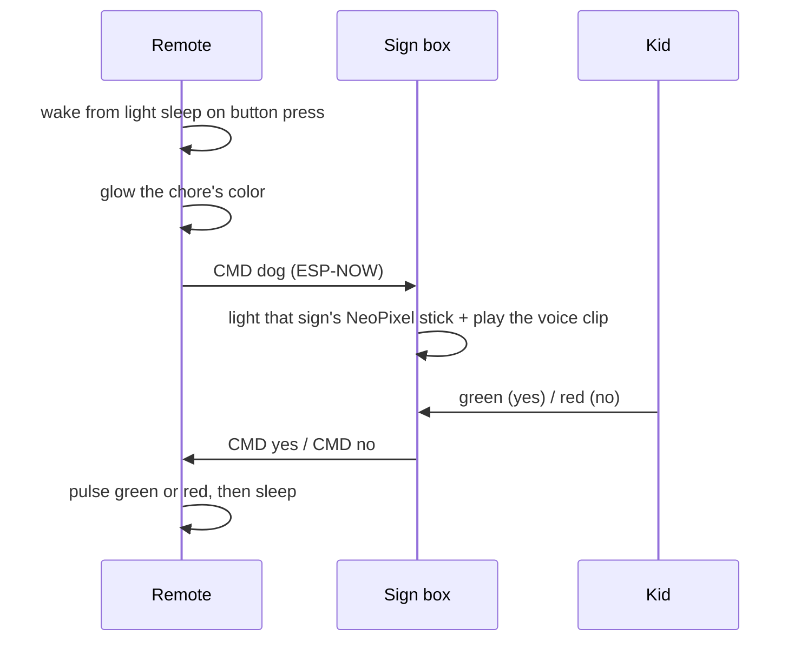

# Chore Box

A wireless "ask and answer" device for a nine-year-old, designed from a blank Fusion 360 sketch through
soldering, 3D printing, and firmware. My daughter came up with the idea; I built it.


[**▶ Watch the full clip with sound**](media/demo.mp4) — the box plays a recording of my voice saying the word.

## The idea

Nagging is a broadcast protocol with no acknowledgment. This replaces it with a request/response handshake
that a kid actually enjoys running.

1. I press one of four icon buttons on the remote — dog, cat, Sophia, coffee.
2. The box lights the matching sign (**NOODLE**, **SONNY**, **SOPHIA**, **COFFEE**) and plays a recording of
   my voice saying the word through its onboard speaker.
3. My daughter answers with the green or red button on top of the box.
4. The remote's window pulses green if she agreed, red if she refused.

Each chore owns a color, and both halves use it: press the coffee button and the remote glows purple while
the COFFEE sign glows purple across the room. The pending state is the color of the thing being asked for.

| Chore | Color |
|---|---|
| Coffee | purple |
| Sophia | orange |
| Dog | blue |
| Cat | yellow |

The coffee button is for my wife.

## How it works



The two halves talk over **ESP-NOW** — no router, no pairing, no network. Each board has the other's MAC
address compiled in, and the payload is a plain ASCII string: `CMD dog`, `CMD yes`, `CMD no`. That's the
whole protocol.

If the box never answers, the remote gives up after 90 seconds, sends `CMD disable` to clear the sign, and
goes back to sleep — so a message dropped in either direction can't leave a sign lit forever.

### The sign box

<p align="center">
  
  
</p>

Four backlit label windows in a 2×2 grid on the front, green and red response buttons on top, speaker firing
up through a printed grille. Behind each window is an [Adafruit NeoPixel
Stick](https://www.adafruit.com/product/1426) — 8 pixels each, 32 in one chain off a single pin — with paper
as the diffuser. Voice clips come off a serial MP3 voice-prompt module driven over a second UART, one track
per chore.

The box stays awake and polls its two buttons every 2 ms, so the answer registers the instant she hits it.

### The remote

<p align="center">
  
  
</p>

A wand form factor sized for one hand: four icon buttons under the thumb, a diffused window for the answer,
and a USB port at the tail for charging. Packing a microcontroller, radio, indicator, and battery into that
cross-section was most of the design work.

The window isn't a display — it's three RGB backlight panels behind paper, driven as nine PWM channels so the
whole face washes to one color. That's what makes the yes/no answer readable from across a room: an
eight-second breathing pulse of green or red, not a symbol you have to walk over and read.

The remote is the half that has to last on a battery, so it spends nearly all of its life in light sleep at
80 MHz with the radio torn down entirely. A button press wakes it, the radio comes up, the message goes out,
and everything shuts back down after the answer.

## Components

| | |
|---|---|
| Microcontrollers | Adafruit HUZZAH32 (ESP32 Feather) — one per half, on 50×70 mm protoboard |
| Wireless | ESP-NOW, unencrypted, peer MACs hard-coded, ASCII `CMD <verb>` payloads |
| Audio | Serial MP3 voice-prompt module (`7E … EF` command frames, 9600 baud) into a small speaker |
| Sign lighting | 4 × Adafruit NeoPixel Stick, 8 pixels each, 32 total on one data pin |
| Remote indicator | 3 × RGB backlight panels, 9 LEDC PWM channels at 5 kHz / 8-bit |
| Diffusion | Paper, behind the sign windows and the remote's face |
| Power | LiPo, **TBD — capacity and measured runtime** |
| Enclosures | 3D printed on a Bambu Lab X1C |

## What I had to learn

None of this was in my wheelhouse when I started. The point of the project was that it wasn't.

**CAD and printing** — Fusion 360 from scratch: parametric sketching, joints, and designing enclosures that
are actually printable. Bambu Studio, supports, orientation, and the fit tolerances you only learn by getting
them wrong. Both enclosures went through **TBD** print revisions before the components dropped in cleanly.

**Electronics** — Choosing the parts at all: which Feather, which MP3 module, what the LEDs and speaker
needed, how to power it. Then soldering the whole thing together by hand on protoboard.

**Firmware** — Arduino, C++. Establishing the wireless link between the two devices and defining a message
format for chore requests and responses. Driving the color states. Putting the remote to sleep and waking it
on a button press so the battery lasts.

**Industrial design** — Form factor and aesthetics, not just function. Something that reads as a product on a
side table, and a remote that feels right in a hand.

## Problems worth talking about

**The wireless link took several attempts.** *(TBD — which approaches failed and why, and what finally sent
me to ESP-NOW. This is the most interesting story in the project.)*

**Battery life meant sleeping the remote.** It wakes on any of the four buttons, brings up the radio, and
tears it back down before sleeping again — the radio is only alive for the seconds it's actually needed. The
design problem is waking fast enough that a button press feels instant. *(TBD — measured runtime.)*

**The answer had to be readable at a glance.** A check mark on a small display is something you have to walk
over and read. A slow pulse of green or red across the whole face is something you catch from the other side
of the room, which is where you are when you're waiting on an answer.

**Packaging.** The remote's cross-section was set by what feels good to hold, not by what fits inside, so
component placement had to work backward from an ergonomic shell.

## Repo contents

```
cad/
  sign.f3d          Fusion 360 model of the sign box
  remote.f3d        Fusion 360 model of the remote
firmware/
  common/           ESP-NOW setup/teardown, message framing, small atomic + mutex helpers
  remote/           button polling, color states, light sleep, reply timeout
  sign/             NeoPixel sign lighting, MP3 playback, yes/no buttons
media/              renders, interior shots, demo clip
```

*(TBD — the Fritzing schematic to be added.)*

---

### To fill in before publishing — delete this section

- [ ] Which wireless approaches failed before ESP-NOW, and how they failed
- [ ] Exact MP3 voice-prompt module part number
- [ ] Exact RGB backlight panel part used in the remote
- [ ] LiPo capacity, measured runtime, and what the target was
- [ ] Which of NOODLE / SONNY is the dog and which is the cat
- [ ] Enclosure revision count
- [ ] How the sign labels themselves are made (printed on the paper diffuser? separate inlay?)
- [ ] Rough project duration, and whether it's still in daily use
- [ ] Push the Fritzing schematic into this repo
